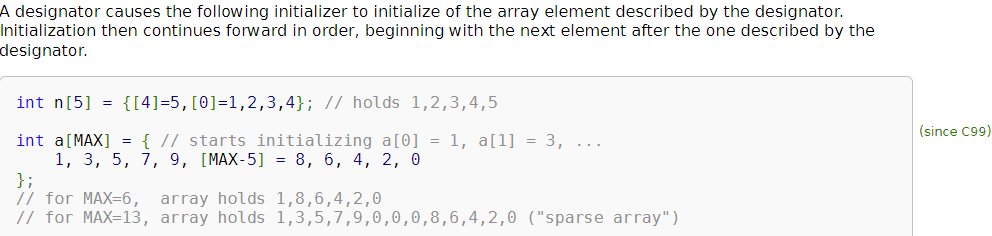
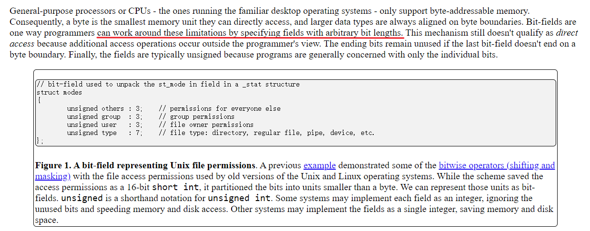
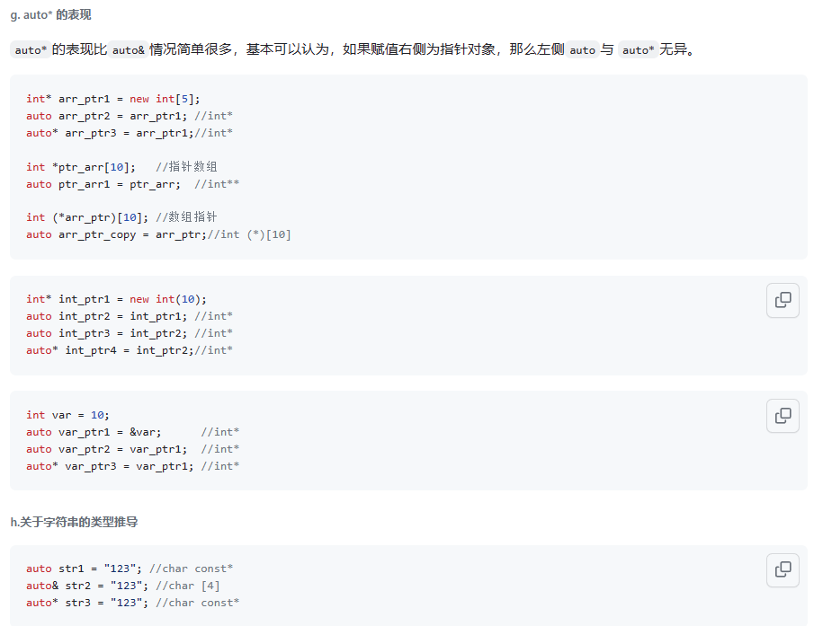

### 宏相关

-  防止头文件重复包含

  ```c++
  // 条件编译指令方式
  #ifndef B_H
  #define B_H
  /* B.h CODE */
  
  #endif 
  // pragma 预处理指令
  #pragma once
  ```

- X-Macros：反复粘贴，直到没有宏可以展开为止

  ```c
  #define NAMES(X) \
    X(Tom) X(Jerry) X(Tyke) X(Spike)
  
  int main() {
    #define PRINT(x) puts("Hello, " #x "!");
    NAMES(PRINT)
  }
  // 其中，X 是一个占位符，它用于表示传递给宏的参数。可以通过 #x 进行展开	
  ```

- `##` 将两边的字符串粘起来

### 头文件

- 对于头文件，尽量只声明函数而不实现函数。尽量只声明全局变量而不定义全局变量。

- 函数的声明

  ```cpp
  int add(int, int); // 变量名可省略，例如后缀运算符重载中的哑元
  ```

### 语法

- 数组初始化

  ```C
  enum { RA, R1, ..., PC };
  u8 R[] = {
    [RA] = 0,  // 
    [R1] = 0,
    ...
    [PC]  = init_pc,
  };
  ```

  ​	

- enum 特性，最后一个可以代表数据结构的大小

  ```c
  enum { RA, ... , PC, NREG }
  ```

- struct bitfield

  Bit-fields allow programmers to specify each field's size measured in bits

  

### 函数

- 泛型编程与编译时类型推导

  ```cpp
  template<typename T1, typename T2>	// 声明模板类型参数
  auto sum(T1& t1, T2& t2) -> decltype(t1 + t2) {
      return t1 + t2;
  }
  
  auto func(int x, int y) -> decltype(x + y) {
      return x + y;
  }
  ```

  - `auto` 与 `decltype` 的区别

    - `auto` 变量必须在定义时初始化
    - `decltype` **以一个普通表达式作为参数**，返回该表达式的类型,而且并不会对表达式进行求值

    

### C++ 类

- 构造函数初始化列表

  将函数体中的赋值写法写到函数体外，便于检查

  ```cpp
  class Student {
      int ID;
  
  public:
      Student(int id): ID(id) { }
  };
  ```

  **PS：**构造函数初始化列表是对类的成员做初始化，而在构造函数体内只是对类的数据成员进行了一次赋值操作

- 委派构造函数

  ```cpp
  class Info {
  public:
      Info() { InitRest(); } // 称为目标构造函数（被调用）
      Info(int i): Info() { type = i; } // 委派构造函数（调用者）
      Info(char e): Info() { name = e; }
  // 委派构造函数不能有初始化列表！
  private:
      void InitRest() { }
      int type {1};
      char name {'a'};  
  };
  ```

- 静态局部变量

  静态局部变量不能在函数外被使用，但是但它的内存空间可以。

- 运算符重载

  ```cpp
  // 函数运算符重载
  public:
      int operator()(int a, int b) {
          cout << "operator() called. " << a << ' ' << b << endl;
          return a + b;
      }
  };
  int s = sum(3, 4); // 等价于 sum.operator()(3， 4);
  
  // 数组下标重载	返回类型为引用时可以被赋值（作为表达式的左值）
  int& operator[] (const char* name) {
          for (int i = 0; i < 7; i++) {
              if (strcmp(week_name[i], name) == 0) 
                  return temperature[i];
          }
          return error_temperature;
      }    
  ```

- 函数返回值优化

  ​	在开启了返回值优化之后，返回局部变量时则不会新构造一个变量再返回，而是直接返回该变量；而如果未开启，C++11 默认会调用移动构造函数构建返回值类。
  
  可以返回引用么？如果返回引用，只有返回**常量局部变量的左值引用**是合法的
  
  如果我们想触发返回值优化条件，则可利用**常量左值引用 ，右值引用 ，构造新对象**的方式接收返回值


### 参考链接

- [编程环境 - SAST skill docs (net9.org)](https://docs.net9.org/languages/c-oop/environment/)
- [auto，auto& 与auto* · Issue #12 · thu-coai/THUOOP (github.com)](https://github.com/thu-coai/THUOOP/issues/12)
- https://jyywiki.cn/ICS/2020/index.html
- https://icarus.cs.weber.edu/~dab/cs1410/textbook/5.Structures/unions.html